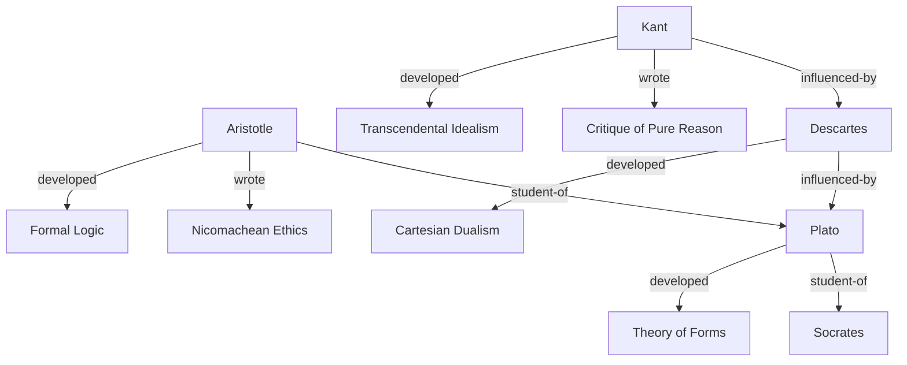

# Great Thinkers

A knowledge graph of philosophers, scientists, and their ideas. Demonstrates NuSy-nano's hybrid search across interconnected documents.

## Structure

```
great-thinkers/
├── people/          # Thinkers (philosophers, scientists, mathematicians)
├── concepts/        # Ideas, theories, movements
└── works/           # Books, papers, treatises
```

## Relationships



## Example Queries

### Semantic Search
```python
kg.search("free will and determinism")
kg.search("how do we know what we know")
kg.search("the nature of reality")
```

### Structured Queries
```python
# Find all Enlightenment thinkers
kg.query("SELECT ?name WHERE { ?p :era 'Enlightenment' ; :name ?name }")

# Find who influenced Kant
kg.query("""
    SELECT ?influencer WHERE {
        :kant :influenced-by ?influencer .
    }
""")
```

### Hybrid Search
```python
# Philosophers who wrote about ethics
kg.hybrid_search("moral philosophy", filters={"type": "person"})

# 20th century works about consciousness
kg.hybrid_search("consciousness and mind", filters={"type": "work", "century": "20"})
```

## Statistics

- **People:** 25+ thinkers across 2500 years
- **Concepts:** 30+ philosophical and scientific ideas
- **Works:** 20+ influential texts
- **Relationships:** 100+ connections

## Sources

Content synthesized from public domain sources including:
- Wikipedia philosophical articles
- Stanford Encyclopedia of Philosophy (summaries)
- Project Gutenberg (work descriptions)

All content is educational and transformative.
